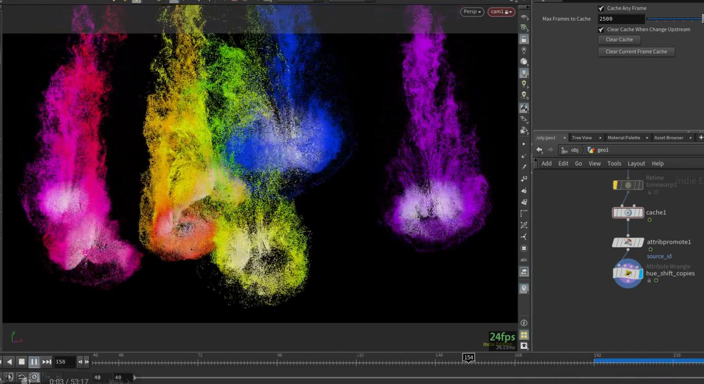
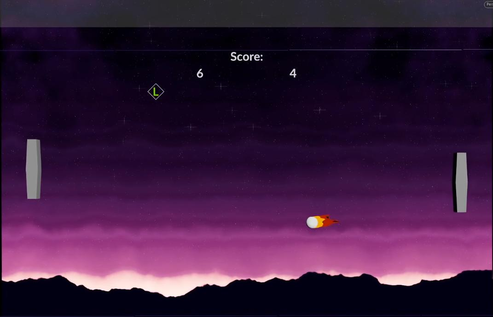

# houdini-hips
A collection of Houdini hip files, examples, tech r&amp;d's, vex, all the good stuff...

## SOP
[Custom HUD](https://github.com/fabriciochamon/houdini-hips/raw/refs/heads/main/hips/custom_hud.hiplc)

Using NDC (normalized device coordinates) to build a custom HUD with extended viewport info.

[Fake volume lights](https://github.com/fabriciochamon/houdini-hips/raw/refs/heads/main/hips/fake_volume_lights.hiplc)

Fake volume light using VEX, with support for omni and spherical area ligths, shadows, light samples (for area lights+shadows), shadow transparency, and a basic surface roughness model.

## CHOP
[Audio visualizers](https://github.com/fabriciochamon/houdini-hips/raw/refs/heads/main/hips/chop_audio_visualizers.zip)

Assorted audio visualizers: spectrum, waveform, audio volume / channels, frequencies.

## DOP
[Filament solver](https://github.com/fabriciochamon/houdini-hips/raw/refs/heads/main/hips/filament_solver.hiplc)

Using the filament solver in DOPs for fake fluid looking ink sims.
Also, [YT video tutorial](https://www.youtube.com/watch?v=jm4mWT_WomE)

## Misc
[Pong game](https://github.com/fabriciochamon/houdini-hips/raw/refs/heads/main/hips/pong_game.hiplc)

RBD based collisions, chop based keyboard controls, logic for item power-ups, score, multi camera angles, game intro, etc. Backgrounds made in copernicus. A complete mini game.

