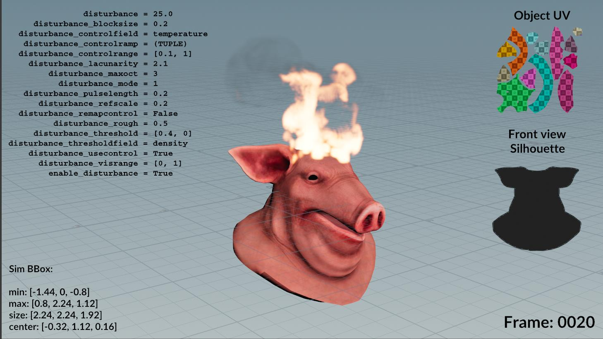
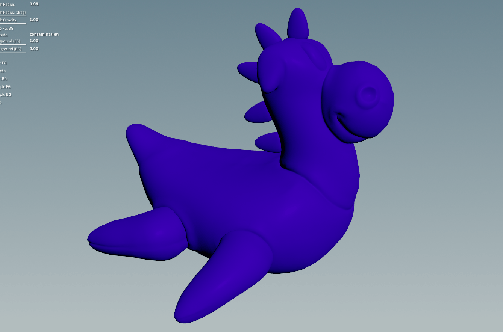
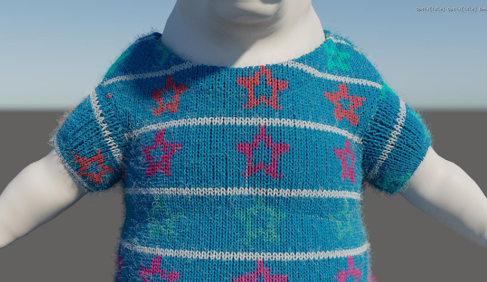
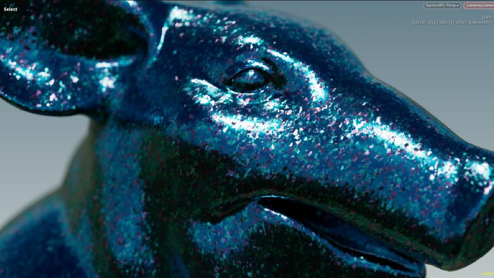
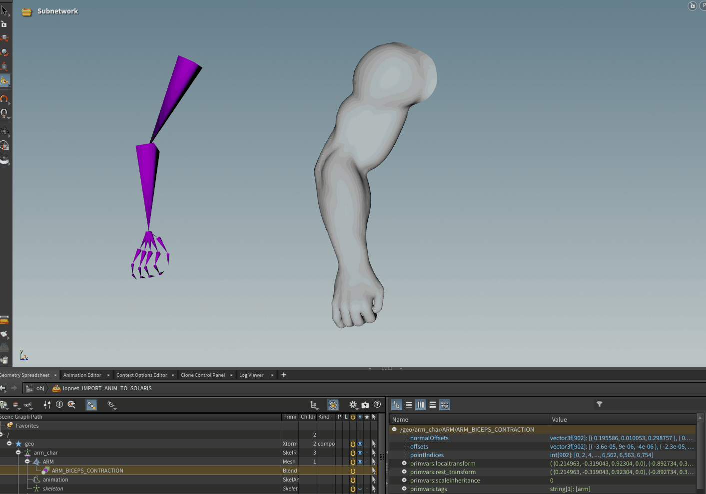
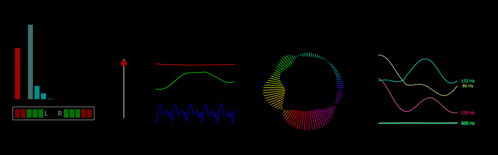
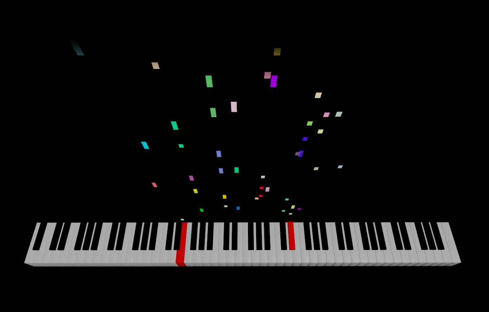
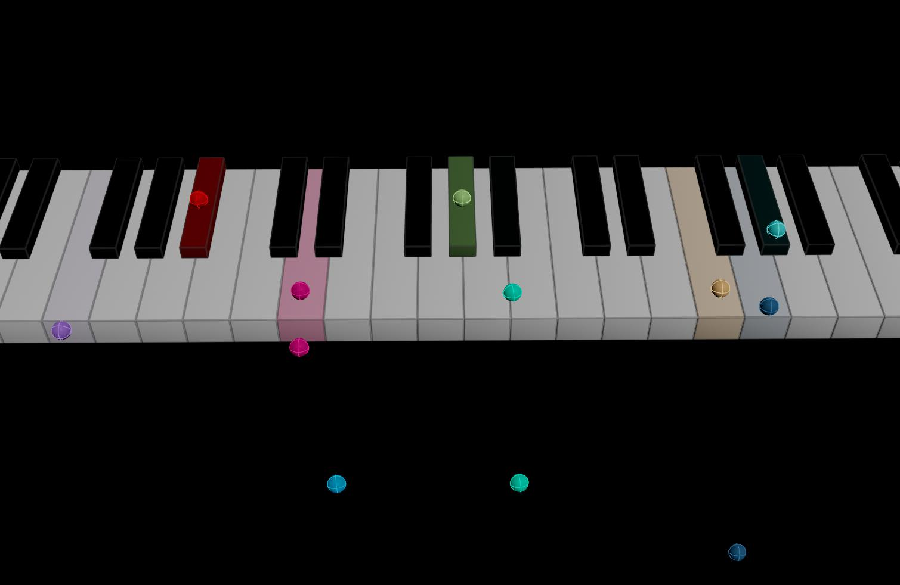
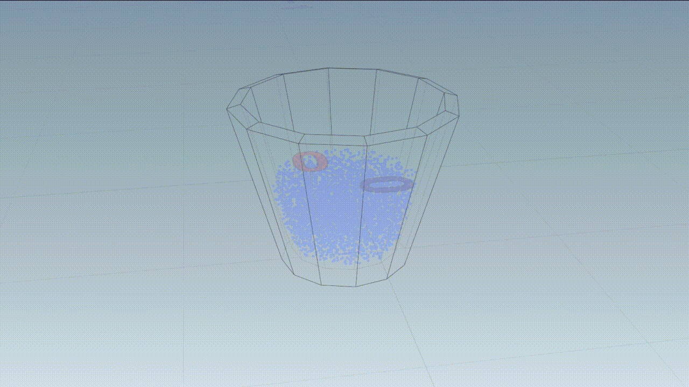

# houdini-hips
A collection of Houdini hip files, examples, tech r&amp;d's, vex, all the good stuff...

- [SOP](#sop)
- [COP (copernicus)](#cop-copernicus)
- [COP (legacy)](#cop-legacy)
- [APEX](#apex)
- [CHOP](#chop)
- [DOP](#dop)
- [Miscellaneous](#misc)

## SOP
[Custom HUD](https://github.com/fabriciochamon/houdini-hips/raw/refs/heads/main/hips/custom_hud.hiplc)

Using NDC (normalized device coordinates) to build a custom HUD with extended viewport info.

[Roll object over irregular surface](https://github.com/fabriciochamon/houdini-hips/raw/refs/heads/main/hips/roll_object_over_irregular_terrain.hiplc)

Animate a point and make an object follow its position, while rolling and sticking to any irregular terrain. (Uses a solver SOP!)

[Fake volume lights](https://github.com/fabriciochamon/houdini-hips/raw/refs/heads/main/hips/fake_volume_lights.hiplc)

Fake volume light using VEX, with support for omni and spherical area ligths, shadows, light samples (for area lights+shadows), shadow transparency, and a basic surface roughness model.

[RBD cube bots](https://github.com/fabriciochamon/houdini-hips/raw/refs/heads/main/hips/rbd_cube_bots.hiplc)

Motor based robot RBDs, scattered over surface, collide with each other.

[Infection solver](https://github.com/fabriciochamon/houdini-hips/raw/refs/heads/main/hips/infection_solver.hiplc)

A paintable infection solver.

[Knitting pattern](https://github.com/fabriciochamon/houdini-hips/raw/refs/heads/main/hips/knitting_pattern.hiplc)

Knitted patterns from a UVd cloth geo.

## COP (copernicus)

[Flakes](https://github.com/fabriciochamon/houdini-hips/raw/refs/heads/main/hips/cop_flakes.hiplc)

COPs based flakes material.

## APEX

[Apex rig to solaris as USDskel (with blendshapes)](https://github.com/fabriciochamon/houdini-hips/raw/refs/heads/main/hips/apex_rig_to_solaris.hiplc)

A complete workflow example: kinefx skeleton > apex rig (using rig components) > blendshape animation > imported into solaris, as USDskel instead of timesampled geo.

## CHOP
[Audio visualizers](https://github.com/fabriciochamon/houdini-hips/raw/refs/heads/main/hips/chop_audio_visualizers.zip)

Assorted audio visualizers: spectrum, waveform, audio volume / channels, frequencies.

[Single audio visualizer, but many controls](https://github.com/fabriciochamon/houdini-hips/raw/refs/heads/main/hips/single_audio_viz_many_controls.zip)

Audio viz with lots of controls.

[Midi piano score](https://github.com/fabriciochamon/houdini-hips/raw/refs/heads/main/hips/midi_piano_score.zip)

A piano score that animates to midi files, in the likes of guitar hero.

[Midi impact balls sound gen](https://github.com/fabriciochamon/houdini-hips/raw/refs/heads/main/hips/midi_impact_balls_sound_gen.zip)

Reads a midi file, generates rbd balls for each note, balls collide with a piano geo (it "plays" the music). The impacts are stored and transformed into a .wav file, as if the balls really played that song. 

## DOP
[Filament solver](https://github.com/fabriciochamon/houdini-hips/raw/refs/heads/main/hips/filament_solver.hiplc)

Using the filament solver in DOPs for fake fluid looking ink sims.
Also, [YT video tutorial](https://www.youtube.com/watch?v=jm4mWT_WomE)

[FLIP fill from interior](https://github.com/fabriciochamon/houdini-hips/raw/refs/heads/main/hips/flip_fill_from_interior.hiplc)

Inject liquid from the interior of a vase. Needs to have some flip tweaks so the produced water actually adds volume to the main body.

[Bullet growing chain links](https://github.com/fabriciochamon/houdini-hips/raw/refs/heads/main/hips/bullet_growing_chain_links.hiplc)

Create chain links dynamically in a sop solver.

[RBD rolling cubes](https://github.com/fabriciochamon/houdini-hips/raw/refs/heads/main/hips/rbd_rolling_cubes.hiplc)

Bullet sim that applies a rotational force to move objects towards goals.

[FLIP melting with custom cooling](https://github.com/fabriciochamon/houdini-hips/raw/refs/heads/main/hips/flip_melting_fx_custom_cooling.hiplc)

FLIP melting fx, using a custom cooling method (VEX). Custom cooling has a min temperature threshold, that when exceeded triggers a frame timer. Once the timer is reached, the cooldown effect takes place by multiplying current temperature by some cooling rate. In my tests this methid gave sims a more organic behavior and better controls over melting regions.

## COP (legacy)

[Arcade/Retro games FX](https://github.com/fabriciochamon/houdini-hips/raw/refs/heads/main/hips/arcade_cop.zip)

Retro game visuals with pixelization, palette reduction, layered tv glitches (scanlines/vignete/crop/running bars/etc) and blinking fonts.

## Misc
[Pong game](https://github.com/fabriciochamon/houdini-hips/raw/refs/heads/main/hips/pong_game.hiplc)

A complete mini game with RBD based collisions, chop keyboard controls, logic for item power-ups, score, multi camera angles, ball split after N hits, game intro, etc. Backgrounds made in copernicus.

